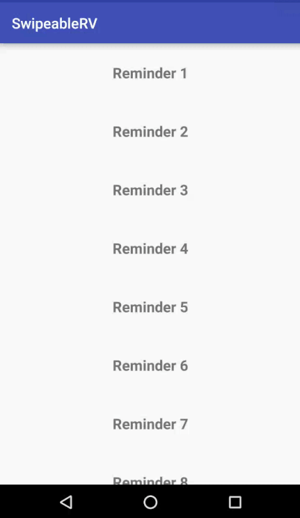

# Unmaintained
I'm unable to maintain this library due to lack of time. If anyone interested, feel free to folk it.

# SwipeableRV
[](https://android-arsenal.com/details/1/5812)

`SwipeableRV` is a library that provides a fast and convenient way to implement the 'swipe to dismiss' feature in Recycler View, as seen in apps such as Messenger.

`SwipeableRV` wraps around `ItemTouchHelper` from the `Android Support Library`. Therefore, developers do not need to do any extra work on `ItemTouchHelper.Callback` themselve. Instead they can just focus on creating a recycler view, adapter, and view holder as normal, plus some minimal work on specifying some details such as supported swipe directions, deletion message or icon.

Below is how `SwipeableRV` looks.



# Usage
`SwipeableRV` is made with the goal of making things as simple as possible. To implement the `RecyclerView` shown above, the following steps are needed.

## XML Layout
````
...
xmlns:stdrv="http://schemas.android.com/apk/res-auto"
...
// instead of normal RecyclerView, 
<io.huannguyen.swipeablerv.view.SWRecyclerView
        android:id="@+id/recycler_view"
        android:scrollbars="vertical"
        android:layout_width="match_parent"
        android:layout_height="match_parent"
        swrv:border_color="@android:color/darker_gray"
        swrv:ltr_swipe_background="#B71C1C"
        swrv:rtl_swipe_background="#009688"
        swrv:ltr_swipe_message="@string/dismiss"
        swrv:rtl_swipe_message="@string/snooze"
        swrv:swipe_message_text_size="16sp"
        swrv:swipe_message_color="#fff"
        swrv:swipe_message_bold="true"
        swrv:ltr_swipe_icon="@drawable/ic_dismiss"
        swrv:rtl_swipe_icon="@drawable/ic_snooze"
        swrv:swipe_icon_color="#FFFFFF"
        swrv:swipe_icon_height="24dp"
        swrv:swipe_icon_width="24dp"
        swrv:swipe_icon_margin="24dp"
        swrv:ltr_snackbar_message="@string/dismissed"
        swrv:rtl_snackbar_message="@string/snoozed"
        swrv:snackbar_message_color="#fff"
        swrv:ltr_snackbar_background="#B71C1C"
        swrv:rtl_snackbar_background="#009688"
        swrv:undo_action_text_color="#fff"
        swrv:has_border="true"/>
````
All the above attributes are optional. If you don't specify them, then the default values (defined within the library) are used.

The above example is for the case in which you need to specify different types of action and effects for different swipe direction (left-to-right and right-to-left). If that is not required (no difference between the swipe directions), then the settings would be simpler:

````
<io.huannguyen.swipeablerv.view.SWRecyclerView
        android:id="@+id/recycler_view"
        android:scrollbars="vertical"
        android:layout_width="match_parent"
        android:layout_height="match_parent"
        swrv:border_color="@android:color/darker_gray"
        swrv:swipe_background="#B71C1C"
        swrv:swipe_message="@string/dismiss"
        swrv:swipe_message_text_size="16sp"
        swrv:swipe_message_color="#fff"
        swrv:swipe_message_bold="true"
        swrv:swipe_icon="@drawable/ic_dismiss"
        swrv:swipe_icon_color="#FFFFFF"
        swrv:swipe_icon_height="24dp"
        swrv:swipe_icon_width="24dp"
        swrv:swipe_icon_margin="24dp"
        swrv:snackbar_message="@string/dismissed"
        swrv:snackbar_message_color="#fff"
        swrv:snackbar_background="#B71C1C"
        swrv:undo_action_text_color="#fff"
        swrv:has_border="true"/>
````

It can be seen that all `ltr_xyz` and `rtl_xyz` attributes are now replaced with a single `xyz` attribute since in `SwipeableRV` the value of a `xyz` attribute can override the values of `ltr_xyz` and `rtl_xyz`. That also means whenever a `xyz` attribute is defined, never define any `ltr_xyz` and/or `rtl_xyz` attribute in the same recycler view.

Notes:
- These attributes can also be set programmatically through an instance of the `SwipeableRV` class.
- By default, the `has_border` attribute has the value of `true`. Setting it `false` would remove the top and bottom borders (shown in the above screen). 

## Java Code
### Adapter
Your adapter has to implements the `SWAdapter` interface. For your convenience, `SwipeableRV` provides 2 abstract classes that implement the interface so you can subclass one of them.

####Subclass `StandardSWAdapter`
`StandardSWAdapter` provides an implementation in which it has a reference to your list of items and directly manipulate (add/remove) the items. With this option, all what you need to do is specifying the type of the items being displayed within the `SWRecyclerView` (i.e., `String` in this example) and define a constructor which takes a list of items as follows.
````
public class SampleAdapter extends StandardSWAdapter<String> {
    public SampleAdapter(List<String> reminderList) {
        this.mItems = reminderList;
    }
}
````
####Subclass `DelegateSWAdapter`
 `DelegateSWAdapter` provides you with more flexibility that you don't need to pass the item list into your adapter. This is designed for cases in which your architecture requires the item list to be manipulated by only a certain class. With this option, you need to provide your own implementation of the `DWItemDelegate` interface and pass it into the adapter's constructor. Example as follows:
````
public class SampleAdapter extends DelegateSWAdapter<String> {
    public SampleAdapter(SWItemDelegate<String> delegate) {
        this.mItems = reminderList;
    }
}
````
Your `DWItemDelegate` should define how the item list is added or removed.
####Provide your own implementation of `SWAdapter` interface
In case the pre-implemented adapters do not meet your need, you can consider implementing your own `SWAdapter`.

###Recycler View Setup
Set up `SWRecyclerView` just the same way as you do for a normal `RecyclerView`, except that you have to include this line:
````
mRecyclerView.setupSwipeToDismiss(your_adapter_instance, swipe_directions);
````
This is a key method that sets up the swipe-to-dismiss feature on the recycler view behind the scene. The `swipe_directions` parameter specifies which directions your items can be swiped (to delete). For example, `ItemTouchHelper.LEFT|ItemTouchHelper.RIGHT` indicates that they can be swiped in both directions (left-to-right as well as right-to-left).

A working example looks something like this:

    // Get your recycler view from the XML layout
    mRecyclerView = (STDRecyclerView) findViewById(R.id.recycler_view);
    LayoutManager layoutManager = new LinearLayoutManager(getApplicationContext());
    mRecyclerView.setLayoutManager(layoutManager);
    mAdapter = new SampleAdapter(versions);
    mRecyclerView.setAdapter(mAdapter);
    
    // allow swiping in both directions (left-to-right and right-to-left)
    mRecyclerView.setupSwipeToDelete(mAdapter, ItemTouchHelper.LEFT|ItemTouchHelper.RIGHT);

That's it! Now you've got a recycler view with swipe-to-dismiss feature. How simple and quick that is?

# List of `SwipableRV`'s attributes
`SwipableRV` make it possible for your to quickly customise most of the text and color related to the swipe actions. Please refer to the following table for a complete list of attributes supported by `SwipableRV` and get the idea of what it can do.

Note: whenever there is 3 version of an attribute, for example `swipe_icon`, `ltr_swipe_icon` and `rtl_swipe_icon`, the value of the first one always override the other two. Therefore, if there is no difference between the settings for left-to-right and right-to-left swipes, you should only specify the general version of the attribute (i.e., `swipe_icon`).

| Attributes                                                                               | Purpose                                                                                                                                                                                                                                                                    | Data type | Default                                   |
|------------------------------------------------------------------------------------------|----------------------------------------------------------------------------------------------------------------------------------------------------------------------------------------------------------------------------------------------------------------------------|-----------|-------------------------------------------|
| has_border                                                                               | Set if the top and bottom line should be drawn around the item being swiped. If this value is set to `false`, the next 2 attributes (about border) would be ignored. This is normally set to `false` if you  already has a separator between items in your  recycler view. | boolean   | true                                      |
| border_color                                                                             | Set separator line color                                                                                                                                                                                                                                                   |   color   | #cccccc                                   |
| border_width                                                                             | Set separator line width                                                                                                                                                                                                                                                   | dimension | 1dp                                       |
| swipe\_icon<br/>ltr\_swipe\_icon<br/>rtl\_swipe\_icon                                                 | Set the icon to be displayed  when an item is being swiped                                                                                                                                                                                                                 |  drawable | a Bin icon                                |
| swipe\_background<br/>ltr\_swipe\_background<br/>rtl\_swipe\_background                               | Set the color of the background  to be displayed when an item is being swiped                                                                                                                                                                                              | color     | #bbbbbb                                   |
| swipe\_icon\_height                                                                        | Set the height of the swipe icon                                                                                                                                                                                                                                           | dimension | 24dp                                      |
| swipe\_icon_width                                                                         | Set the width of the swipe icon                                                                                                                                                                                                                                            | dimension | 24dp                                      |
| swipe\_icon\_color<br/>ltr\_swipe\_icon\_color<br/>rtl\_swipe\_icon\_color                               | Set the color of the swipe icon. This attribute is used whenever you must use an icon that is shared with other part of the app and you want it to have a different color.                                                                                                 | color     | no color                                  |
| swipe\_icon\_margin<br/>ltr\_swipe\_icon\_margin<br/>rtl\_swipe\_icon\_margin                            | Set the margin of the swipe icon (the gap between the swipe icon and the corresponding edge of the item view in which it is displayed in)                                                                                                                                  | dimension | 24dp                                      |
| swipe\_message<br/>ltr\_swipe\_message<br/>rtl\_swipe\_message                                        | Set the message being displayed next to the swipe icon when an item is being swiped. This is usually for describing what action is to be carried out after an item is swiped in a certain direction                                                                        | string    | Null                                      |
| swipe\_message\_color<br/>ltr\_swipe\_message\_color<br/>rtl\_swipe\_message\_color                      | Set the swipe message's color                                                                                                                                                                                                                                              | color     | #000                                      |
| swipe\_message\_font\_path                      | Set the path to the font being used to display the swipe message. If this is not set, the message is displayed with the system's default font.                                                                                                                                                                                                                                              | string     | Null                                     |
| swipe\_message\_bold                      | used only when the default font is used. Setting this attribute to `true` means that the message would be displayed in bold style                                                                                                                                                                                                                                               | boolean     | false                                     |
| swipe\_message\_text\_size<br/>ltr\_swipe\_message\_text\_size rtl_swipe_message_text_size          | Set the size of the swipe message                                                                                                                                                                                                                                          | dimension | 14sp                                      |
| swipe_icon_and_message_gap ltr_swipe_icon_and_message_gap rtl_swipe_icon_and_message_gap | Set the gap between the swipe icon and message                                                                                                                                                                                                                             | dimension | 10dp                                      |
| allow_undo                                                                               | Set if undo action (on snack bar) is enabled. If this value is set to `false`, the snack bar's related attributes below would be ignored                                                                                                                                   | boolean   | true                                      |
| snackbar_message ltr_snackbar_message  rtl_snackbar_message                              | Set the message shown on snack bar after an item is swiped away                                                                                                                                                                                                            | string    | Null                                      |
| snackbar_message_color ltr_snackbar_message_color trl_snackbar_message_color             | Set the snack bar message's color                                                                                                                                                                                                                                          | color     | No color  (System's color would be taken) |
| snackbar_background  ltr_snackbar_background  rtl_snackbar_background                    | Set the snack bar's background color                                                                                                                                                                                                                                       | color     | No color  (System's color would be taken) |
| undo_action_text  ltr_undo_action_text  rtl_undo_action_text                             | Set the action named displayed on the snack bar                                                                                                                                                                                                                            | string    | "UNDO"                                    |
| undo_action_text_color  ltr_undo_action_text_color  rtl_undo_action_text_color           | Set the color of the undo action text                                                                                                                                                                                                                                      | color     | No color  (System's color would be taken) |
# More Settings
Above I've shown how to use `SwipeableRV` in the simple case in which the same snack bar message is displayed for all item swiped in the same direction, and no additional processing is made whenever an item is removed or added back (by clicking on the `undo` action button). In this section, I'll show you some additional features of `SwipeableRV `.

## Specify different snack bar messages for different items
You can override the `getSnackBarMessage(ViewHolder viewHolder, int direction)` function in the your implementation of the `SWAdapter` interface. In the default implementation, the `snackbar_message` (see the list of attributes above) specified in `SWRecyclerView` is returned.

## Specify different swipe directions for different items
You can override the `getUndoActionText(ViewHolder viewHolder, int direction)` function in your `SWAdapter` class. By default, this function returns -1, which means the swipe directions for this item is identical to the swipe directions that was set via `SWRecyclerView`'s `setupSwipeToDismiss(SWAdapter, SnackbarDataProvider, int)` method.

## Specify additional actions when an item is removed from or added back to a Recycler View
You can create a class that implements the `SWItemRemovalListener` interface and assign this listener to an instance of `SWAdapter`. Within this interface, the following 3 methods should be implemented:

* `onItemTemporarilyRemoved(T item, int position)`: this method is called when an item is swiped to dismiss from a `SWRecyclerView` and a `Snackbar` is shown (if the `allow_undo` attribute is not set to `false`).
* `onItemPermanentlyRemoved(T item)`: this method is called when the "undoable" period has ellapsed and item can't be added back to the list anymore. This is a suitable place for permanently removing the item from database for instance
* `onItemAddedBack(T item, int position)`: this method is called when an item is added back to a `SWRecyclerView` after the `undo` button on a `Snackbar` is tapped.

##Programmatically build swipe message
From the above example and attribute list, we know that the swipe message(s) can be set via XML layout. In case you need to programmatically build the swipe messages, take the following as an example. You can have a look in `SwipeMessageBuilder` for more attributes and functions.

````
mRecyclerView.getSwipeMessageBuilder()
                     .withMessage(getString(R.string.new_message))
                     .withFontPath(getString(R.string.droidSerif))
                     // build both messages with the same settings
                     // use SwipeMessageBuilder.LTR or SwipeMessageBuilder.RTL
                     // if you want to build a message for only one
                     // swipe direction
                     .withSwipeDirection(SwipeMessageBuilder.BOTH)
                     .build();
````

# Download
`SwipeableRV` has been uploaded to JCenter. You can download it by adding the following dependency into your project.
````
compile 'io.huannguyen.swipeablerv:swipeable-rv:1.0.2'
````
# Sample Project
You can access a sample project using `SwipeableRV` from the `demo` module in this repo.

# Contributions & Questions
Any contribution is welcome. If you find a bug, please feel free to create an issue. If you have any suggestion/recommendation of new features or anything, shoot me an email at huan.nguyentuong@gmail.com or send me a pull request.
